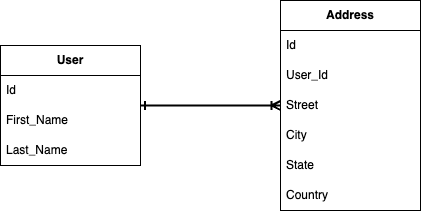
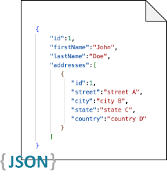
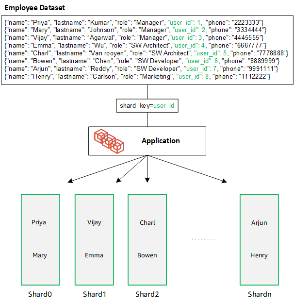
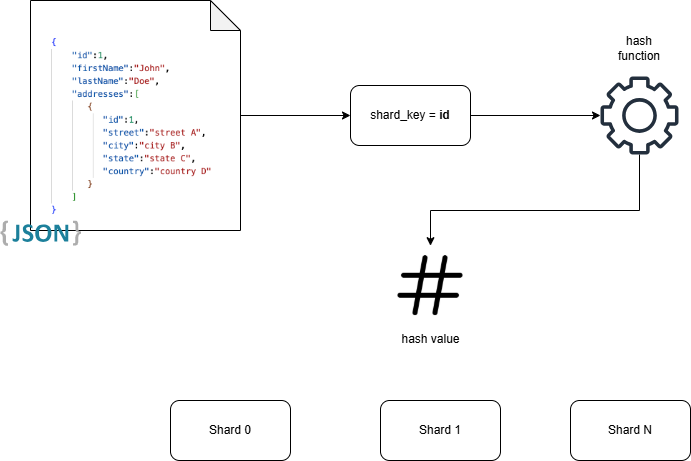

# AWS Document DB POC

### Reads 

- https://docs.localstack.cloud/user-guide/aws/docdb/
- https://aws.amazon.com/blogs/database/integrate-your-spring-boot-application-with-amazon-documentdb/
- https://whattodevnow.medium.com/using-localstack-with-docker-compose-to-mock-aws-services-bb25a5b01d4b

### What is

- Fully managed, scalable, and highly available document database service
- DocumentDB is designed to be compatible with MongoDB
- O Amazon DocumentDB é compatível com o MongoDB 3.6, 4.0 e 5.0.

1. What is a document database?
   - common way of data model in normalized rows and columns
   - On application level usually we represent data into JSON format
   - Document database let you persist data into database using same model that we use in application
   - 
   - 
   - Both represent same data model using different structures
   - Pro: flexible schema 

2. How it works?
   - create a cluster
      - two components
         - cluster volume
            - manage data to instances
            - An Amazon DocumentDB cluster volume is a virtual database storage volume that spans multiple Availability Zones.
               - each AZ has a copy of the data
            - can have 0 to 16 instances
         - instances
            - cluster is 0 or n database instances
            - processing power for the database
            - writes data to, reads data from the cluster storage volume
            - Cluster instances do not need to be of the same instance class, and they can be provisioned and terminated as desired.
            - instances type:
               - primary instance
                  - each AWS DocumentDB cluster has one primary instance
                  - support read and writes
                  - perform all data modifications to cluster volume
               - replica instance
                  - support only read 
                  - each AWS DocumentDB can have up to 15 instances 
                  - enables distribute read workload
                  - May enable Multi AZ Availability

   - Replication
      - Write operation to primary instance, the primary instance executes a durable write to the cluster volume
      - After the primary instance replicates the state of the write (not the data) to each ACTIVE replica
         - Read replicas does NOT participate on the write process
            - downside for read scaling
            - Reads from Amazon DocumentDB replicas are eventually consistent with minimal replica lag—usually less than 100 milliseconds after the primary instance writes the data
      - Amazon DocumentDB replicas are also failover targets and are quickly promoted if the primary instance for your Amazon DocumentDB cluster fails.

   - Storage
      - data is stored in cluster volume
         - single, virtual volume that uses SSDs
      - cluster volume
         - consists of six copies of your data
         - data is automatically replicated across multiple Availability Zones (AZ) in single AWS Region
         - Replication helps ensure high durability, less possibility of data loss, also higher availability during failover because data already exist in other AZ, since these copies could continue to serve data to instances of the AWS DocumentDB
      
      - How is billed?
         - charged for the space that you use in an Amazon DocumentDB cluster volume
            - Amazon DocumentDB 4.0, when data is removed (drop collection, index, database) the overall allocated space decreases
            - Amazon DocumentDB 3.6 even if you remove data the volume itseft does not decrease, you only freed up space on the volume
               -  costs are based on the storage "high water mark" (the maximum amount that was allocated for the Amazon DocumentDB cluster at any point in time).
   
   - Reliability 
      - https://docs.aws.amazon.com/documentdb/latest/developerguide/how-it-works.html#how-it-works.reliability
      - designed to be reliable, durable and fault tolerant
      - storage auto-repair
         - Since we have copies of the data in multiple AZ's, this reduce the change of data loss by storage failure.
         - When a segment of cluster volume fails, it uses the data from other volumes that make up the cluster to ensure the the data repaired is correct
            - reducing the need to perform a point-in-time restore to recover from an instance failure.
      - Survivable cache warming
         - The page cache is manages in a separate process from the database so that the page cache can survive independently of the database.
         - If occour an database failure the cache remains in memory
            - the buffer pool is warmed when the database restart
      - Crash Recovery
         - After crash the AWS Document DB will perform crash recovery async in parallel threads
      - Resource governance 
         - when an instance is experiencing high memory pressure, the requests will be throttle. Some operations may be queued to wait for memory pressure to subside. If the memory pressure continues, the queue operations may suffer timeouts.
      
   - Read preference options
      - Amazon DocumentDB does not rely on replicating data to multiple instances to achieve durability.
      - The cluster data is durable with 1 or 15 instances
      - Write durability
         - Amazon DocumentDB uses a unique, distributed, fault-tolerant, self-healing storage system.
         - When writing, the database ensures that all writes are durably recorded on majority of nodes before ack the write to the client.
         - An acknowledged write from an Amazon DocumentDB primary instance is durable, and can't be rolled back
      - Read Isolation
         - reads only return data already durable before the query begins
         - read never return data modified after the query begins
         - no dirty read
         - read consistency 
            - read from primary instance are strongly consistent under normal operation conditions and have read-after-write consistency 
               (is the ability to view changes (read data) right after making those changes (write data))
            - if a failover event happens between the write and the following read, DocumentDB returns a not strongly consistent read, all the read replicas are eventually consistent.
      - Amazon DocumentDB read preferences
         - supports to read preference only when reading data from cluster endpoint in replica set mode
            - replica set mode:
               - The reader endpoint load balances read-only connections across all available replicas in your cluster.
            - if the connection is not on replica set mode, then the preference is ignored
         - read preference option affects how driver routes read request to instance of Amazon DocumentDB cluster
         - set preference on general level or specific query
         - supported read preferences:
            - primary
               - all read are routed to primary instance
               - if primary is unavailable, read fails
               - read-after-write consistency over high availability and read scaling
            - primaryPreferred
               - on normal conditions read is routed to primary instance
               - if has a primary failover, the client routes to a replica.
               - on normal operation we have the read-after-write consistency and on failover scenario a eventual consistentency
               - read-after-write consistency over read scaling, but still require high availability.
            - secondary
               - reads are only routed to a replica, never the primary
               - no replica instance on cluster, read fails
               - eventual consistency 
               - prioritize primary instance write throughput over high availability and read-after-write consistency.
            - secondaryPreferred
               - read are routed to read replica when one or more replicas are active.
               - when has none read replica routes read to primary
               - still eventual consistency when we use a read replica
               - prioritize read scaling and high availability over read-after-write consistency.
            - nearest
               - read is routed based only on latency measure between client and all instances in the cluster.
               - eventual consistency when routes to read replica
               - read-after-write consistency when routes to primary
               - prioritize achieving the lowest possible read latency and high availability over read-after-write consistency and read scaling.
         - High availability
            - When the primary instance fail, an replica will be promoted as new primary
               - Meanwhile the write and read requests to the primary will fail
               - If the cluster does not have replicas the primary will be recreated
                  - but this is slower than promote a replica to primary
               - Replicas that are inteded to use as failover should have the same instance class as the primary one
         - Scaling reads
            - Data replication happens within the cluster volume and not between instances.
            - each replica’s resources are dedicated to processing your queries, not replicating and writing data.
   - Transactions
      - Amazon DocumentDB (with MongoDB compatibility) now supports MongoDB 4.0 compatibility including transactions.
      - Transactions enables atomic, consistent, isolated, and durable (ACID) operations across one or more documents within an Amazon DocumentDB cluster
      - There is no additional cost for transactions.
      - Must use AWS Document DB 4.0 Engine and use MongoDB driver 4.0 or greater

      - Limitations:
         - Amazon DocumentDB does not support cursors within a transaction.
         - No support to retryable write, commit, abort
         - transactions have 1min execution limit and sessions has 30min timeouts
      
      - Transaction isolation level:
         - when we start a transaction we can specify `readConcern` and `writeConcern`
            - readConcern
               - snapshot isolation by default
            - writeConcern
               - majority by default
               - write quorum is achieved when four copies of the data are persisted across three AZs
      
      - Use cases:
         - multi-statement:
            - write a transaction that spans multiple statements with an explicit commit or rollback
            - group insert, update, delete, and findAndModify actions as a single atomic operation.

            ```mongodb
            var session = db.getMongo().startSession({causalConsistency: false});   
            var bankDB = session.getDatabase("bank");
            var accountCollection = bankDB["account"];

            session.startTransaction();

            // deduct $500 from Alice's account
            var aliceBalance = accountColl.find({"name": "Alice"}).next().balance;
            var newAliceBalance = aliceBalance - amountToTransfer;
            accountColl.update({"name": "Alice"},{"$set": {"balance": newAliceBalance}});

            // add $500 to Bob's account
            var bobBalance = accountColl.find({"name": "Bob"}).next().balance;
            var newBobBalance = bobBalance + amountToTransfer;
            accountColl.update({"name": "Bob"},{"$set": {"balance": newBobBalance}});

            session.commitTransaction();
            ```

         - multi-collection: 
            - perform multiple operations within a single transaction and across multiple collections.
            
            ```mongodb
            var session = db.getMongo().startSession({causalConsistency: false});   
            var accountCollInBankA = session.getDatabase("bankA")["account"];
            var accountCollInBankB = session.getDatabase("bankB")["account"];

            session.startTransaction();

            // deduct $500 from Alice's account
            var aliceBalance = accountCollInBankA.find({"name": "Alice"}).next().balance;
            var newAliceBalance = aliceBalance - amountToTransfer;
            accountCollInBankA.update({"name": "Alice"},{"$set": {"balance": newAliceBalance}});

            // add $500 to Bob's account
            var bobBalance = accountCollInBankB.find({"name": "Bob"}).next().balance;
            var newBobBalance = bobBalance + amountToTransfer;
            accountCollInBankB.update({"name": "Bob"},{"$set": {"balance": newBobBalance}});

            session.commitTransaction();
            ```
   
   - Amazon DocumentDB elastic cluster sharding
      - Amazon DocumentDB elastic clusters use hash-based sharding to partition data across a distributed storage system.
        - Algorithm: hash function transforms the shard key into hash and uses this hash to partition the data across 
       - Sharding, also known as partitioning, splits large data sets into small data sets across multiple nodes enabling you to scale out your database beyond vertical scaling limits
      - AWS Document DB decouples compute from storage, allowing scale independently of each other

      - Shard definitions
         - Shard
            - A shard provides compute for an elastic cluster.
            - Single writer instance and 0-15 read replicas
            - By default, a shard will have two instances: a writer and a single read replica.
         - Shard Key
            - Required field on JSON document in shared collections that elastic cluster uses to distribute read and write to matching shard
         - Sharded collection
            - Collection whose data is distributed across an elastic cluster in data partitions
         - Partition
            - Logical portion of shared data
            - When shared collection is created, the data is organized into partitions inside each shard basead on the shard key

      - Distributing data across configured shards
         - 
         - A good shard key will evenly partition your data across the underlying shards, giving your workload the best throughput and performance. 

      - 
