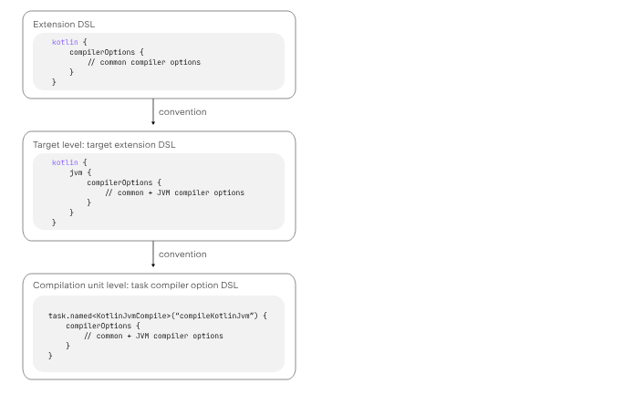

# Kotlin 2.0 POC

### References

- https://kotlinlang.org/docs/whatsnew20.html
- https://kotlinlang.org/docs/whatsnew2020.html

### Maven configuration
```maven
<properties>
    <java_version>21</java_version>
    <kotlin.version>2.0.20</kotlin.version>
    <maven.compiler.source>${java_version}</maven.compiler.source>
    <maven.compiler.target>${java_version}</maven.compiler.target>
    <maven.compiler.release>${java_version}</maven.compiler.release>
    <kotlin.compiler.jvmTarget>${java_version}</kotlin.compiler.jvmTarget>
    <kotlin.code.style>official</kotlin.code.style>
</properties>

<build>
    <sourceDirectory>src/main/kotlin</sourceDirectory>
    <testSourceDirectory>src/test/kotlin</testSourceDirectory>
    <plugins>
        <plugin>
            <groupId>org.jetbrains.kotlin</groupId>
            <artifactId>kotlin-maven-plugin</artifactId>
            <version>${kotlin.version}</version>
            <executions>
                <execution>
                    <id>compile</id>
                    <phase>compile</phase>
                    <goals>
                        <goal>compile</goal>
                    </goals>
                </execution>
                <execution>
                    <id>test-compile</id>
                    <phase>test-compile</phase>
                    <goals>
                        <goal>test-compile</goal>
                    </goals>
                </execution>
            </executions>
        </plugin>
        <plugin>
            <artifactId>maven-surefire-plugin</artifactId>
            <version>2.22.2</version>
        </plugin>
        <plugin>
            <artifactId>maven-failsafe-plugin</artifactId>
            <version>2.22.2</version>
        </plugin>
        <plugin>
            <groupId>org.codehaus.mojo</groupId>
            <artifactId>exec-maven-plugin</artifactId>
            <version>1.6.0</version>
            <configuration>
                <mainClass>MainKt</mainClass>
            </configuration>
        </plugin>
    </plugins>
</build>

<dependencies>
    <dependency>
        <groupId>org.jetbrains.kotlin</groupId>
        <artifactId>kotlin-test-junit5</artifactId>
        <version>${kotlin.version}</version>
        <scope>test</scope>
    </dependency>
    <dependency>
        <groupId>org.jetbrains.kotlin</groupId>
        <artifactId>kotlin-stdlib</artifactId>
        <version>${kotlin.version}</version>
    </dependency>
</dependencies>
```

### Features

- [x] https://kotlinlang.org/docs/whatsnew20.html#local-variables-and-further-scopes
- [x] https://kotlinlang.org/docs/whatsnew20.html#type-checks-with-logical-or-operator
- [x] https://kotlinlang.org/docs/whatsnew20.html#inline-functions
- [x] https://kotlinlang.org/docs/whatsnew20.html#properties-with-function-types
- [x] https://kotlinlang.org/docs/whatsnew20.html#exception-handling
- [x] https://kotlinlang.org/docs/whatsnew20.html#increment-and-decrement-operators
- [x] https://kotlinlang.org/docs/whatsnew20.html#experimental-kotlin-power-assert-compiler-plugin

### Outputs

Kotlin 2.0.0 was released: May 21, 2024

#### Kotlin Multiplatform improvements

In Kotlin 2.0.0, was made improvements in the K2 compiler related to Kotlin Multiplatform in the following areas:

Separation of common and platform sources during compilation
  - The previous kotlin compiler had some design that enabled the common source code access platform code, 
  which could cause different behavior between platform, and also settings and dependencies could leak to platform

Different visibility levels of expected and actual declarations
  - expected and actual declarations
    - declare on common code standard Kotlin construct and mark it with `expect`, should not have any implementation.
    This can be a function, property, class, interface, enumeration, or annotation.
    - each platform-specific provides the implementation. The platform declare the same construct in the same package 
    and mark it with the `actual` keyword. This is your actual declaration, 
    which typically contains an implementation using platform-specific libraries.

Kotlin 2.0.0 supports different visibility levels, only if the `actual` declaration is more **permissive** than the `expected`

```kotlin
expect internal class Attribute // Visibility is internal
actual class Attribute          // Visibility is public by default, which is more permissive
```

#### Enable K2 compiler

- https://kotlinlang.org/docs/k2-compiler-migration-guide.html#support-in-ides
  - Settings > Languages & Frameworks > Kotlin > Enable K2 mode
    

#### Kotlin/JVM
Kotlin 2.0.0 can generate classes containing Java 22 bytecode

- Generation of lambda functions using invokedynamic
  - Kotlin 2.0.0 introduces a new default method for generating lambda functions using `invokedynamic`

- The kotlinx-metadata-jvm library is now Stable
  - the lib `kotlin-metadata-jvm` became stable, this library provides an API to read and modify metadata of binary files generated by the Kotlin/JVM compiler.

#### Kotlin/Native

- Monitoring GC performance with signposts on Apple platforms
  - Is possible to monitor garbage collector via logs, but previously these logs were not integrated with 
  Xcode Instruments, a popular toolkit for investigating issues with iOS apps' performance. 
  Now GC reports pauses with signposts that are available in Instruments.

- Resolving conflicts with Objective-C methods
    - On Objective-C you can have methods with different names but same params types and names,
    in kotlin the methods have the same signature and caused overloads errors
    - Kotlin 2.0.0 introduces the new `@ObjCSignatureOverride` annotation, that makes the compiler ignore conflicting overloads
    - This approach is better because before was necessary to disable globally conflicting overloads

- Changed log level for compiler arguments in Kotlin/Native
  - log level for compiler arguments in Kotlin/Native Gradle tasks, such as compile, link, and cinterop, has changed from info to debug
  - consistency and better observability
  
- Explicitly added standard library and platform dependencies to Kotlin/Native
  - Previously, the Kotlin/Native compiler resolved standard library and platform dependencies implicitly
    - inconsistency how kotlin gradle plugins across targets 
  - Now, the Kotlin/Native compiler explicitly includes standard library and platform dependencies in its compile-time

#### [Kotlin/Wasm](https://kotlinlang.org/docs/whatsnew20.html#kotlin-wasm)
    - interoperability with JavaScript

- Optimized production builds by default using Binaryen
  - Only on production compilation uses [binaryen](https://github.com/WebAssembly/binaryen)
    - should improve performance and reduce lib size

- Support for named export
  - Named exports make it easier to share code between Kotlin and JavaScript modules. They improve readability and help you manage dependencies between modules.

  ```kotlin
    // kotlin:
    @JsExport
    fun add(a: Int, b: Int) = a + b
  ```

  ```javascript
    // javascript:
    import { add } from "./index.mjs"
  ```

- Support for unsigned primitive types in functions with @JsExport
  - Can use unsigned primitive types (UByte, UShort, UInt, ULong) with `@JsExport`

- Generation of TypeScript declaration files in Kotlin/Wasm
  - Kotlin/Wasm compiler is now capable of generating TypeScript definitions from any @JsExport declarations in your Kotlin code.

- Support for catching JavaScript exceptions
  - In Kotlin 2.0.0, we have implemented support for catching JavaScript exceptions within Kotlin/Wasm
  - try-catch to handle `Throwable` or `JsException` errors properly
  - `finally` block also works
- New exception handling proposal is now supported as an option
- The withWasm() function is split into JS and WASI variants

#### Kotlin/JS

- New compilation target
  - support for ES2015 standard features
  ```gradle
  kotlin {
    js {
        compilerOptions {
            target.set("es2015")
        }
    }
  }
  ```

Suspend functions as ES2015 generators https://kotlinlang.org/docs/whatsnew20.html#suspend-functions-as-es2015-generators

Passing arguments to the main function

Per-file compilation for Kotlin/JS projects
  - previously the Kotlin/JS compiler could generate a single .js file for all the project, or module (default option)
  - Now kotlin 2.0.0 also is possible to generate one .js per kotlin 
    ```gradle
    // build.gradle.kts
    kotlin {
        js(IR) {
            useEsModules() // Enables ES2015 modules
            browser()
        }
    }
    ```
    ```gradle
    # gradle.properties
    kotlin.js.ir.output.granularity=per-file // `per-module` is the default
    ```

Improved collection interoperability
  - Use kotlin data structures on JS
    ```kotlin
    // Kotlin
    @JsExport
    data class User(
      val name: String,
      val friends: List<User> = emptyList()
    )
    
    @JsExport
    val me = User(
      name = "Me",
      friends = listOf(User(name = "Kodee"))
    )
    ```
    ```javascript
    // JavaScript
    import { User, me, KtList } from "my-module"
    
    const allMyFriendNames = me.friends
      .asJsReadonlyArrayView()
      .map(x => x.name) // [‘Kodee']
    ```

Support for createInstance()
  - Use the function `createInstance` https://kotlinlang.org/api/latest/jvm/stdlib/kotlin.reflect.full/create-instance.html
  - On runtime get instance of class

Support for type-safe plain JavaScript objects
    - https://kotlinlang.org/docs/whatsnew20.html#support-for-type-safe-plain-javascript-objects
  - only supported on K2 compiler
  - experimental plugin
  - //todo

Support for npm package manager
    - before only yarn as package manager (yarn still default)
    - now also is possible to use npm
    ```gradle
    # gradle.properties
    kotlin.js.yarn = false
    ```

Changes to compilation tasks
    - separation of target directories for webpack, distributeResources and distribution

Discontinuing legacy Kotlin/JS JAR artifacts

#### Kotlin/Gradle
- compatible with Gradle 6.8.3 through 8.5

New Gradle DSL for compiler options in multiplatform projects 
    
    
    - values from higher levels compiler options are passed as default values from lower levels 
        - extension compiler options > target compiler options > compilation unit (task) compiler options

    - values from lower levels override related settings from higher level
        - task level > target > extension 

New Compose compiler Gradle plugin
    - https://kotlinlang.org/docs/whatsnew20.html#new-compose-compiler-gradle-plugin

New attribute to distinguish JVM and Android-published libraries
    - `org.gradle.jvm.environment` is published by default with all Kotlin variants
    -  This attribute helps distinguish JVM and Android variants of Kotlin Multiplatform libraries.
    - values: "android", "standard-jvm", or "no-jvm".
    - to disable:
    ```gradle
    # gradle.properties
    kotlin.publishJvmEnvironmentAttribute=false
    ```

Improved Gradle dependency handling for CInteropProcess in Kotlin/Native

    
        