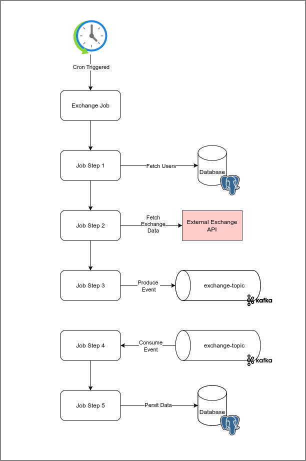
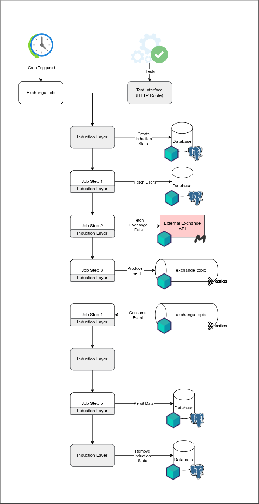

# Queue Testing

### Test Target



### How to Test



### Stack

- Java 26
- Kotlin 2.4.0
- Maven
- Spring Boot 4.1.0
- Postgres 18
- Apache Kafka
- Test Containers Postgres
- Test Containers Kafka
- Test Containers Mock Server
- Mock Server Client Java

### Tests

```bash
[INFO] 
[INFO] Results:
[INFO] 
[INFO] Tests run: 5, Failures: 0, Errors: 0, Skipped: 0
[INFO] 
[INFO] 
[INFO] --- jar:3.5.0:jar (default-jar) @ queue-testing-poc ---
[INFO] Building jar: /home/passos/Documentos/workspace/kotlin-sandbox/queue-testing-poc/target/queue-testing-poc-0.0.1-SNAPSHOT.jar
[INFO] 
[INFO] --- spring-boot:4.1.0:repackage (repackage) @ queue-testing-poc ---
[INFO] Replacing main artifact /home/passos/Documentos/workspace/kotlin-sandbox/queue-testing-poc/target/queue-testing-poc-0.0.1-SNAPSHOT.jar with repackaged archive, adding nested dependencies in BOOT-INF/.
[INFO] The original artifact has been renamed to /home/passos/Documentos/workspace/kotlin-sandbox/queue-testing-poc/target/queue-testing-poc-0.0.1-SNAPSHOT.jar.original
[INFO] 
[INFO] --- install:3.1.4:install (default-install) @ queue-testing-poc ---
[INFO] Installing /home/passos/Documentos/workspace/kotlin-sandbox/queue-testing-poc/pom.xml to /home/passos/.m2/repository/com/gabrielspassos/queue-testing-poc/0.0.1-SNAPSHOT/queue-testing-poc-0.0.1-SNAPSHOT.pom
[INFO] Installing /home/passos/Documentos/workspace/kotlin-sandbox/queue-testing-poc/target/queue-testing-poc-0.0.1-SNAPSHOT.jar to /home/passos/.m2/repository/com/gabrielspassos/queue-testing-poc/0.0.1-SNAPSHOT/queue-testing-poc-0.0.1-SNAPSHOT.jar
[INFO] ------------------------------------------------------------------------
[INFO] BUILD SUCCESS
[INFO] ------------------------------------------------------------------------
[INFO] Total time:  01:18 min
[INFO] Finished at: 2026-08-14T09:06:07-03:00
[INFO] ------------------------------------------------------------------------
```