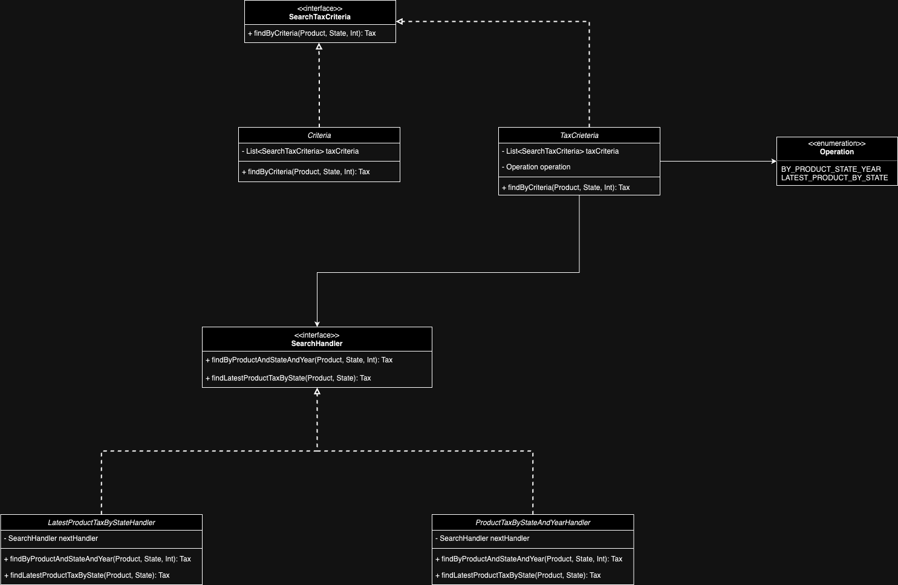

# TAX SERVICE POC

## Requirements
- Build a TAX system where different products have different tax per state and year.
- No database
- ZERO persistence
- no maps / data structure
  - only list
- nao ter dependencia entre classes
  - criar dependencias em outros lugares

# Queries
- [x] qual o tax de 2023 de um determinado state?
- [x] qual o tax atual daquele produto em determinado state?
- [ ] como pegar todas as taxas do ano 2023 
- [] como adicionar as taxas do ano 2024

# Class diagram

# TODOs:

- [x] Class diagram
- [ ] Code
- [ ] Tests

# Suggestions
- chain
  - https://refactoring.guru/design-patterns/chain-of-responsibility
- specification
  - https://medium.com/@carlosraphael/specification-design-pattern-in-java-8-bac6f5f943bc
  - https://dzone.com/articles/specification-pattern-quickly
- val taxes = TaxFactory.getTaxes(2023)
  - run specification 

